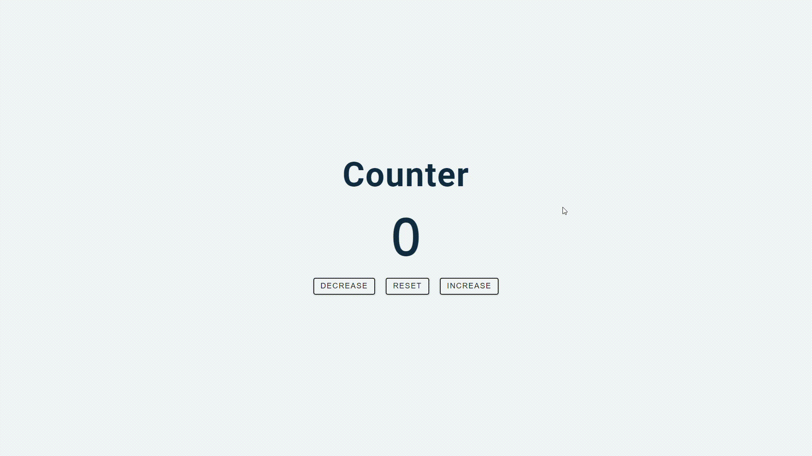
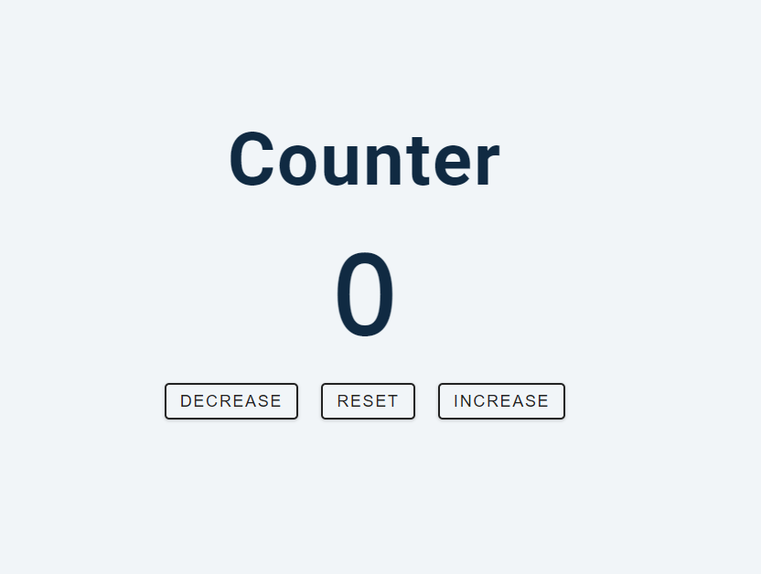
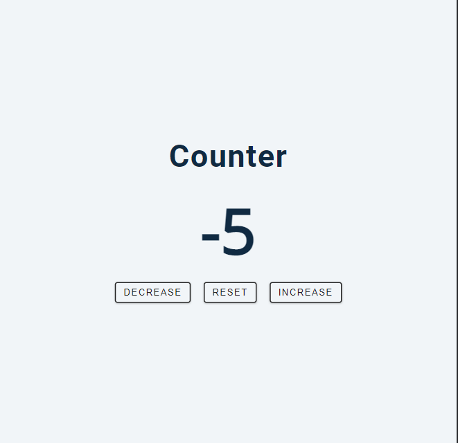
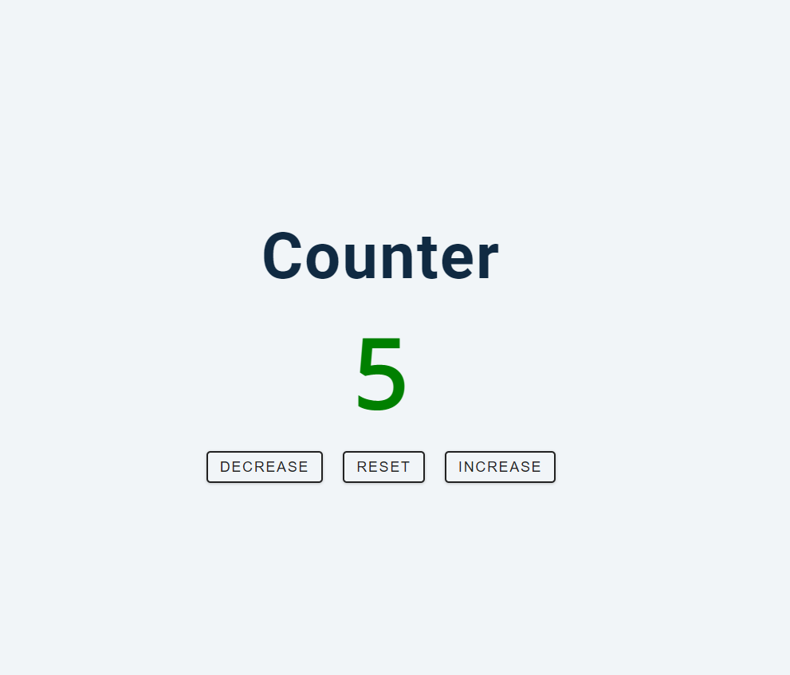

# Counter

El proyecto consiste en desarrollar un contador en JavaScript utilizando addEventListener. Tendrá 3 botones: uno para avanzar en números positivos, otro para retroceder y uno para restablecer el contador a cero.

## Gif del counter

## Capturas de pantalla

Aquí hay algunas capturas de pantalla del proyecto:

